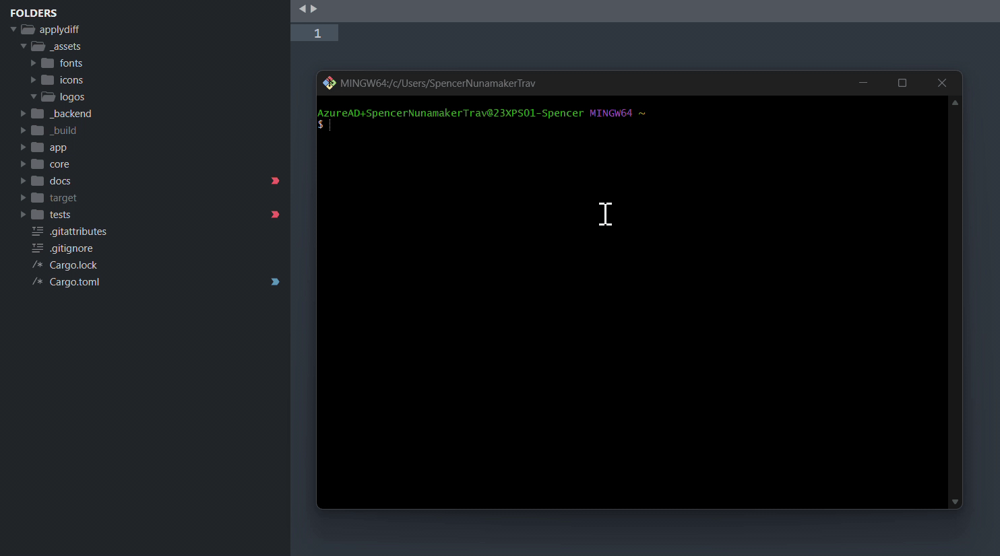
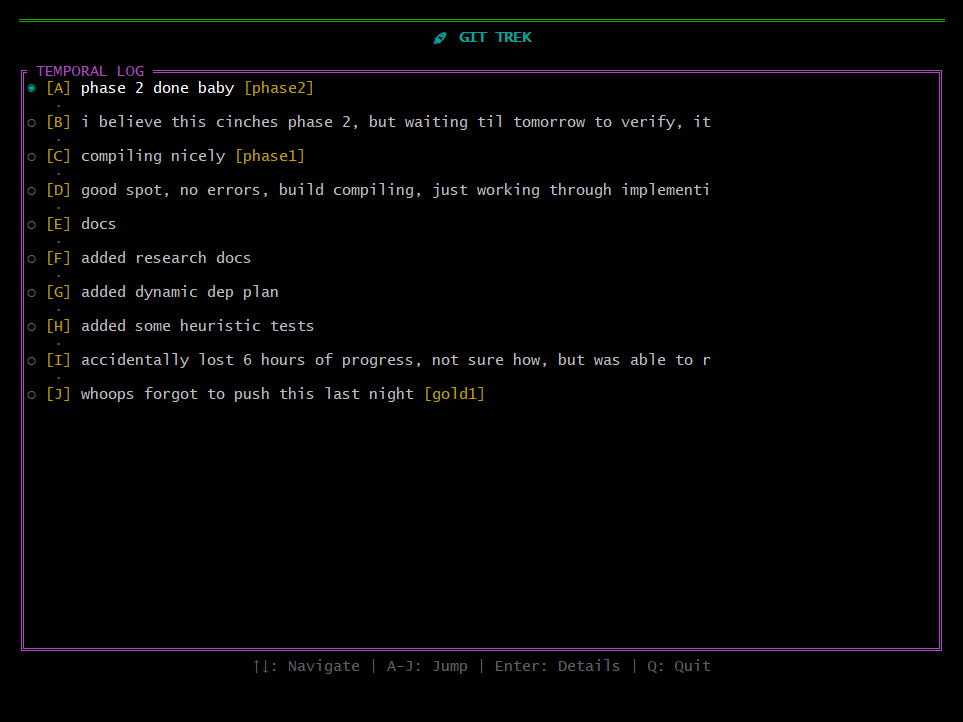
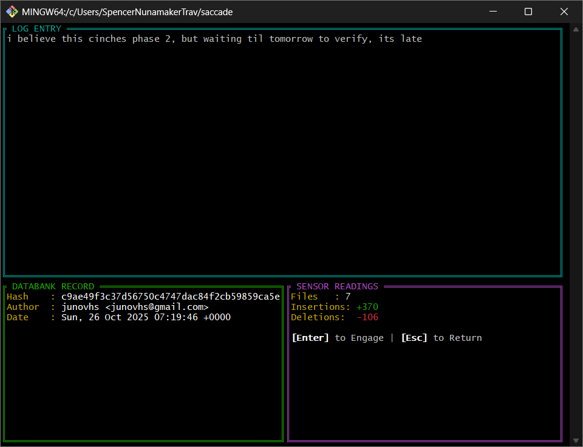

# 🚀 git-trek

```
╔═══════════════════════════════════════════════════════════════╗
║                                                               ║
║   ██████╗ ██╗████████╗   ████████╗██████╗ ███████╗██╗  ██╗  ║
║  ██╔════╝ ██║╚══██╔══╝   ╚══██╔══╝██╔══██╗██╔════╝██║ ██╔╝  ║
║  ██║  ███╗██║   ██║         ██║   ██████╔╝█████╗  █████╔╝   ║
║  ██║   ██║██║   ██║         ██║   ██╔══██╗██╔══╝  ██╔═██╗   ║
║  ╚██████╔╝██║   ██║         ██║   ██║  ██║███████╗██║  ██╗  ║
║   ╚═════╝ ╚═╝   ╚═╝         ╚═╝   ╚═╝  ╚═╝╚══════╝╚═╝  ╚═╝  ║
║                                                               ║
║            Navigate Git History Like It's 1989!              ║
║                                                               ║
╚═══════════════════════════════════════════════════════════════╝
```

> *"Captain's Log, Stardate 2024: Where we're going, we don't need `git log --graph`."*

<p align="center">
  
</p>

**git-trek** is a highly-visual, interactive TUI that transforms your git history into a navigable timeline. It's a command console for time travel through your codebase, designed for developers who want to safely explore the state of their code at any point in time—without the risk of accidental `git reset`.

## 🏁 Installation

### Prerequisites

The only requirement is the **Rust toolchain**. If you don't have it, you can install it with a single command:

```bash
# This command will download and run rustup, the official Rust installer
curl --proto '=https' --tlsv1.2 -sSf https://sh.rustup.rs | sh
```

### Option 1: Install Directly from GitHub (Recommended)

This is the fastest way to install `git-trek`. The command will fetch the source code, compile it, and place the final binary in your Cargo path, making it immediately available.

```bash
cargo install --git https://github.com/junovhs/git-trek.git
```

### Option 2: Build from Source

If you prefer to clone the repository manually:

```bash
# 1. Clone the repository
git clone https://github.com/junovhs/git-trek.git
cd git-trek

# 2. Compile and install the binary
cargo install --path .
```

After installation, run `git-trek` from inside any git repository to start.

## 🎯 Features

-   **Interactive Timeline Scrubbing**: Navigate your commit history with arrow keys. Your working directory updates in real-time, allowing you to instantly see the state of your code and run tests at any point.

    

-   **Detailed Commit Inspection**: Press `Enter` to open a high-detail view of any commit, showing the full commit message, author, date, and diff statistics (files changed, insertions, deletions).

    

-   **Instant-Jump Navigation**: Each visible commit is labeled `[A]` through `[J]` for immediate, single-keystroke navigation.

-   **Safe, Non-Destructive Checkout**: The checkout process is designed for safety. It uses a confirmation prompt and places you in a "detached HEAD" state, leaving your original branch completely untouched and making it trivial to return.

-   **Thematic Sci-Fi Interface**: A retro-futuristic UI that makes exploring history feel less like a chore and more like an adventure.

## 🕹️ The Workflow

1.  **Launch**: Run `git-trek` in your repository.
2.  **Navigate**: Use the arrow keys or `A-J` to scrub through the timeline. Watch your editor and file system update instantly.
3.  **Inspect**: See a commit you're interested in? Press `Enter` to open the detail view and see the full message and stats.
4.  **Engage**: From the detail view, press `Enter` again to initiate a safe checkout. After a `[Y/N]` confirmation, you'll be placed in a detached HEAD state at that commit.
5.  **Return**: Quit with `Q` at any time to safely return your branch to its original state.

## ⌨️ Controls

| View | Key | Action |
| :--- | :--- | :--- |
| **Timeline** | `↑` `W` / `↓` `S` | Navigate to previous/next commit |
| | `A` - `J` | Jump directly to labeled commit |
| | `Enter` | Open the Detail View for the selected commit |
| | `Q` / `Esc` | Quit the application, restoring original state |
| **Detail View** | `Enter` / `C` | Proceed to checkout confirmation |
| | `Q`/`Esc`/`Backspace` | Return to the Timeline View |
| **Confirmation** | `Y` | Confirm and perform the safe checkout |
| | `N`/`Esc`/`Backspace`| Cancel and return to the Detail View |

## 🚨 Requirements

-   A Git repository.
-   A clean working tree (commit or stash your changes before running).
-   A terminal that supports colors.

## 🛠️ Development

```bash
# Run in development mode
cargo run

# Build the optimized release binary
cargo build --release
```

---

*Made with coffee and rust by developers who think git should be more fun.*